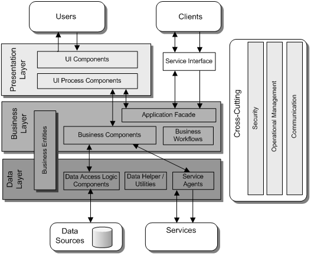
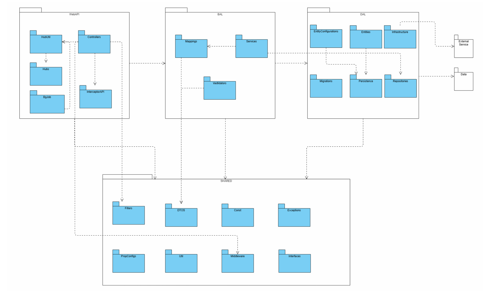

# AISEA Backend - FPT University Capstone SU25

This repository contains the backend services for the **AISEA** project, developed using **.NET 8.0**.

---

## Table of Contents

- [Project Structure](#project-structure)
- [Prerequisites](#prerequisites)
- [Setup Instructions](#setup-instructions)
- [Running the Application](#running-the-application)
- [Implementation Notes](#implementation-notes)

---


## Architecture Overview

### 3-Layer Architecture (Extended with SHARED Layer)



---

## Project Structure

```
Back-end/
├── AISEA.ApiService/
│   ├── AISEA.ApiService.WebApi/        # Web API startup project
│   │   └── Dockerfile                  # Dockerfile for WebApi
│   ├── AISEA.ApiService.BAL/           # Business logic layer
│   ├── AISEA.ApiService.DAL/           # Data access layer
│   ├── AISEA.ApiService.SHARED/        # Shared utilities/models
│   └── AISEA.ApiService.sln            # Solution file
├── docker-compose.yml                  # Docker Compose configuration
├── .gitignore                          # Git ignore file
└── README.md                           # This file
```

**AISEA.ApiService** contains:
- Web API (`AISEA.ApiService.WebApi`)
- Business Logic (`BAL`)
- Data Access (`DAL`)
- Shared Code (`SHARED`)

---

## Prerequisites

- **Docker**: Install Docker Desktop (includes Docker Compose)
- **.NET SDK 8.0**: Required for local development or building outside Docker ([Download from Microsoft](https://dotnet.microsoft.com/download))
- **Git**: For cloning the repository
- **IDE**: Visual Studio 2022, Rider, or VS Code

---

## Setup Instructions

### Clone the Repository

```sh
git clone <repository-url>
cd Back-end
```

### Verify Directory Structure

Ensure the directory structure matches the one described above. Key files:

- `AISEA.ApiService/AISEA.ApiService.WebApi/Dockerfile`
- `docker-compose.yml`

---

## Running the Application

The services are containerized and orchestrated using Docker Compose.

### Build and Start Containers

Navigate to the Back-end directory and run:

```sh
docker-compose up --build
```

This builds the Docker images for `AISEA.ApiService.WebApi`.
The Web API will be available at [http://localhost:5000](http://localhost:5000).

### Stop Containers

To stop the services:

```sh
docker-compose down
```

---

## Access the API

Open a browser or use a tool like Postman to access [http://localhost:5000](http://localhost:5000) (e.g., [http://localhost:5000/swagger](http://localhost:5000/swagger) if Swagger is enabled).

---


---

## Backend Package Diagram



---

## Implementation Notes

### ApiService Package Structure

The project uses a **3-layer architecture** in .NET Core Web API:

- **Controller (API)** — includes both RESTful endpoints and background worker services
- **BAL (Business Logic)**
- **DAL (Data Access)**

#### SHARED Folder

The `SHARED` folder should only include:
- Utility properties and methods
- Third-party interfaces (DAL will implement via "Service Agents")
- _Do not include application-specific business logic here_

#### Security & Middleware

- Endpoints are **secured by default**. Use the `[AllowAnonymous]` attribute to allow unauthenticated access for specific endpoints.
- Middleware handles exceptions (e.g., `InvalidToken`, `NullReferenceException`) and returns HTTP error codes in a consistent JSON format.

#### Error Handling

For errors caused by invalid user input or business logic violations:
- **Do not** return a generic 5XX error.
- Instead, define a custom exception type in the `SHARED` project.
- Use the `MiddlewareException` class to return a well-formatted, expected error response.


